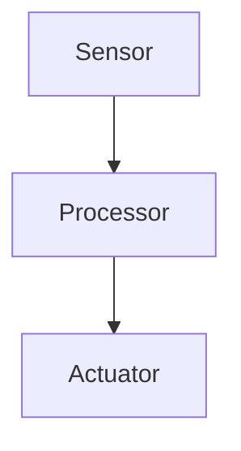

# Diagrams & Visual Assets

This directory contains visual assets for each chapter of the Physical AI & Humanoid Robotics book.

## Directory Structure

```
diagrams/
├── chapter-01/    # Physical AI Foundations
├── chapter-02/    # ROS 2 Essentials
├── chapter-03/    # Gazebo Simulation
├── chapter-04/    # Unity Digital Twins
├── chapter-05/    # Isaac Sim Setup
├── chapter-06/    # Perception & Vision
├── chapter-07/    # Control & Planning
├── chapter-08/    # VLA Systems Intro
├── chapter-09/    # Voice Robotics
├── chapter-10/    # Capstone Architecture
├── chapter-11/    # Capstone Implementation
├── chapter-12/    # Testing & Validation
└── chapter-13/    # Deployment & Next Steps
```

## Diagram Types

- **Mermaid diagrams** (`.md`): Flowcharts, sequence diagrams, architecture diagrams
- **SVG files** (`.svg`): Vector graphics for system diagrams
- **PNG files** (`.png`): Screenshots from simulations

## Naming Conventions

- Use lowercase with hyphens: `sensor-motor-loop.svg`
- Include chapter prefix when shared: `ch02-ros2-architecture.png`
- Alt text should describe visual content for accessibility

## Creating Mermaid Diagrams

Docusaurus supports inline Mermaid diagrams. Example:

```markdown

```

## Image References

In chapter Markdown files, reference images as:

```markdown

```
