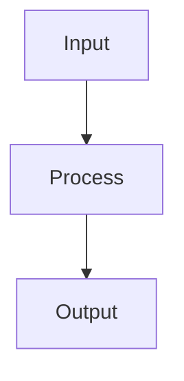

# Research Synthesis: Physical AI & Humanoid Robotics

**Feature**: 001-robotics-book | **Created**: 2025-12-13
**Purpose**: Consolidate research findings for chapter writers and reviewers

---

## Executive Summary

This document synthesizes research across the four major domains covered in the Physical AI & Humanoid Robotics book:

1. **Physical AI Foundations** - Embodied intelligence, sensor-motor systems
2. **ROS 2 & Communication** - Distributed robotics middleware
3. **Simulation Platforms** - Gazebo, Unity, Isaac Sim
4. **VLA Systems** - Vision-Language-Action architectures

---

## 1. Physical AI Foundations

### Core Concepts

**Physical AI** is the intersection of artificial intelligence and robotics where intelligent algorithms control physical systems in real-world environments. Unlike traditional software AI that operates on abstract data, Physical AI systems:

- **Perceive** the world through sensors (cameras, lidar, IMUs)
- **Reason** about physical constraints and dynamics
- **Plan** actions that respect real-world physics
- **Execute** movements through actuators (motors, joints)
- **Adapt** to unexpected changes in the environment

### Embodied Intelligence

The founding insight is that intelligence emerges from physical interaction with the world:

- Learning through sensor-motor feedback loops
- Understanding physics through repeated interactions
- Building internal models from experience

### Simulation-First Development

Key reasons for simulation:
- **Safety**: Test dangerous scenarios without risk
- **Cost**: No hardware damage during development
- **Speed**: Run millions of iterations overnight
- **Reproducibility**: Reset to identical conditions

---

## 2. ROS 2 Core Concepts

### Architecture

ROS 2 Humble provides distributed robotics middleware:

- **Nodes**: Independent computational processes
- **Topics**: Named pub-sub message channels
- **Services**: Request-response communication
- **Actions**: Long-running tasks with feedback
- **Parameters**: Runtime configuration

### Key APIs (rclpy)

```python
# Node creation
node = rclpy.create_node('my_node')

# Publisher
pub = node.create_publisher(Twist, '/cmd_vel', 10)

# Subscriber
sub = node.create_subscription(Twist, '/cmd_vel', callback, 10)

# Service
srv = node.create_service(SetBool, 'toggle', handle_request)
```

### Common Message Types

| Message | Description | Example Usage |
|---------|-------------|---------------|
| `geometry_msgs/Twist` | Linear/angular velocity | Motion commands |
| `sensor_msgs/Image` | Camera images | Vision processing |
| `sensor_msgs/LaserScan` | Lidar point cloud | Obstacle detection |
| `nav_msgs/Odometry` | Position/velocity | Localization |

---

## 3. Simulation Platforms

### Platform Comparison

| Feature | Gazebo | Unity | Isaac Sim |
|---------|--------|-------|-----------|
| Physics Engine | CPU | CPU | GPU (PhysX) |
| Visual Fidelity | Good | Excellent | Photorealistic |
| ROS 2 Integration | Native | Bridge | Native |
| AI/ML Support | Limited | Good | Excellent |
| Learning Curve | Low | Medium | High |

### Gazebo (Garden)

- **Strengths**: Open-source, ROS-native, accessible
- **Use case**: Academic research, prototyping
- **Key formats**: URDF, SDF

### Unity

- **Strengths**: Visual quality, game engine ecosystem
- **Use case**: Digital twins, visualization
- **Key component**: Articulation Body for robotics

### Isaac Sim

- **Strengths**: GPU acceleration, AI-native, synthetic data
- **Use case**: Large-scale training, enterprise deployment
- **Key format**: USD (Universal Scene Description)

---

## 4. VLA Systems & LLM Planning

### VLA Architecture

Vision-Language-Action systems integrate:

1. **Vision**: Camera/lidar perception
2. **Language**: Natural language understanding
3. **Action**: Robot command execution

### LLM-Based Planning

```
User: "Pick up the red cup"
    ↓
LLM Planning: [locate_object("red cup"), move_to(object), grasp(), lift()]
    ↓
Action Primitives: ROS 2 commands to robot
```

### Prompt Engineering for Robotics

Key considerations:
- Provide environmental context
- Define available actions clearly
- Specify output format (JSON/structured)
- Include safety constraints

### Action Primitives

| Primitive | Description | Parameters |
|-----------|-------------|------------|
| `move_to` | Navigate to position | x, y, z |
| `grasp` | Close gripper | force |
| `release` | Open gripper | - |
| `rotate` | Turn in place | angle |

---

## 5. Writing Guidelines

### Target Audience

- **Level**: Beginner (no prior ROS/robotics experience)
- **Background**: Python programming, basic math
- **Goals**: Build working robots, understand AI integration

### Readability Standards

- **Flesch grade**: 8-10 (accessible to high school students)
- **Jargon rule**: Explain within 2 sentences of first use
- **Code comments**: Explain "why", not just "what"

### Chapter Structure Template

1. Introduction & Motivation (150-200 words)
2. Learning Objectives (5-7 checkboxes)
3. Core Concepts (300-450 words)
4. Practical Walkthrough (250-400 words)
5. Code Examples (2-4 complete examples)
6. Diagrams (1-2 visuals)
7. Common Pitfalls (3-4 anti-patterns)
8. Summary & Exercises

### Code Example Standards

```python
#!/usr/bin/env python3
"""
Brief description of what this code does.
Part of Chapter X: Topic Name
"""

import rclpy
from geometry_msgs.msg import Twist

def main():
    """Main entry point with clear setup."""
    rclpy.init()

    # Create node with descriptive name
    node = rclpy.create_node('descriptive_name')

    # ... implementation ...

    rclpy.shutdown()

if __name__ == '__main__':
    main()
```

---

## 6. Diagram Guidelines

### Required Diagrams Per Chapter

1. **Architecture diagram**: System components and data flow
2. **Process diagram**: Step-by-step workflow

### Mermaid Format

```markdown

```

### Naming Conventions

- `chapter-XX-descriptive-name.md` (Mermaid source)
- `chapter-XX-descriptive-name.png` (Screenshot)
- `chapter-XX-descriptive-name.svg` (Vector graphic)

---

## 7. Common Mistakes to Avoid

### Technical

- Using ROS 1 syntax in ROS 2 code
- Incorrect message type specifications
- Unbounded queue sizes (memory leaks)
- Hard-coded file paths

### Content

- Copy-pasting from official docs without rewriting
- Skipping error handling in examples
- Assuming prior knowledge of robotics terms
- Overly complex math without intuition

### Structural

- Inconsistent terminology across chapters
- Missing links to next chapter
- Incomplete code examples
- Diagrams without alt text

---

## 8. References

### Official Documentation

- [ROS 2 Humble Documentation](https://docs.ros.org/en/humble/)
- [Gazebo Garden Tutorials](https://gazebosim.org/docs/garden/)
- [NVIDIA Isaac Sim](https://developer.nvidia.com/isaac-sim)
- [Unity Robotics Hub](https://github.com/Unity-Technologies/Unity-Robotics-Hub)

### Research Papers (Conceptual)

- VLA architectures: Language-guided robot control
- Sim-to-real transfer: Domain randomization techniques
- Embodied AI: Learning from physical interaction

### Code Examples Repository

All code examples are stored in `docs/code-examples/` organized by chapter.

---

## Document History

| Date | Author | Changes |
|------|--------|---------|
| 2025-12-13 | Implementation Agent | Initial synthesis from chapter content |
